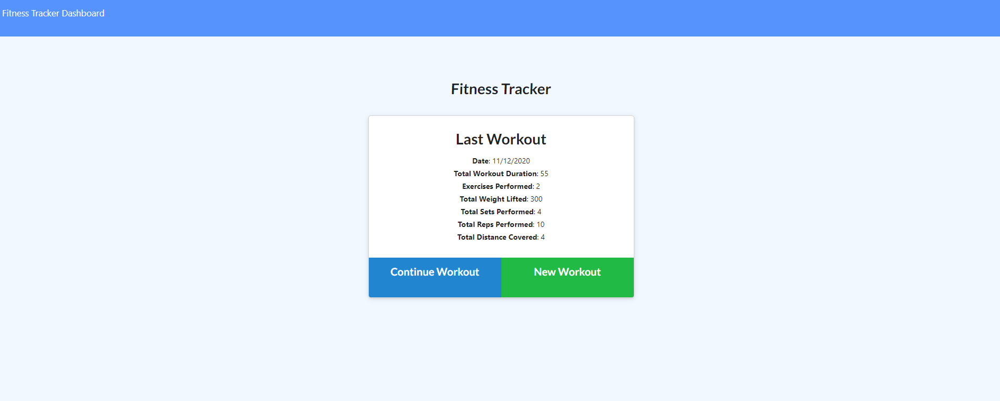
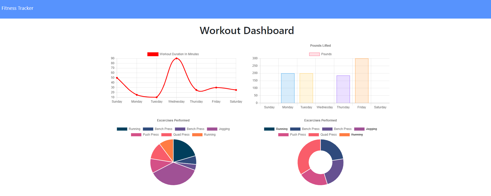

  # Fitness-Tracker - NoSQL

  

  ## Descripton
  An applicaiton that allows a user to track their workouts over a given period of time. The user is first prompted to create a work and enter all excercise information. They may continue adding exercises until finished. Once done, the complete workout button is clicked and a variety of information about the workout is displayed. Further, the user can access a clean dashboard giving them information on all of their workouts. The applicaiton utilizes express and mongoose, along with a MongoDB Atlas database.

  ## Table of Contents
  * [Installation](#installation)
  * [Usage](#usage)
  * [Contributing](#contributing)
  * [Tests](#tests)
  * [Questions](#questions)

  ## Installation 
    
  *Steps required to install package:* 
    
  npm i

  ## Usage

  *Examples of project use:*
  
  [Heroku-Deployed-Link](https://glacial-headland-25853.herokuapp.com/)
  
  
  

  ## Contributing

  *If you are interested in contributing to this project, please follow the below instructions:*

  Pull requests not welcome at this time.

  ## Tests

  *Application tests and instructions for them:*

  N/A

  ## License

  None
  

  ## Questions

  *If you have any questions regarding this application, please utilize the below contact information:*

  [kmiller343@gmail.com](mailto:kmiller343@gmail.com)
  
  [GitHub Profile](https://www.github.com/k1te-m)
  
